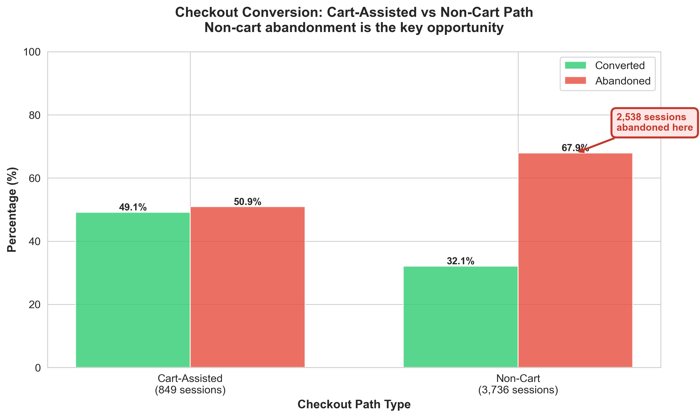
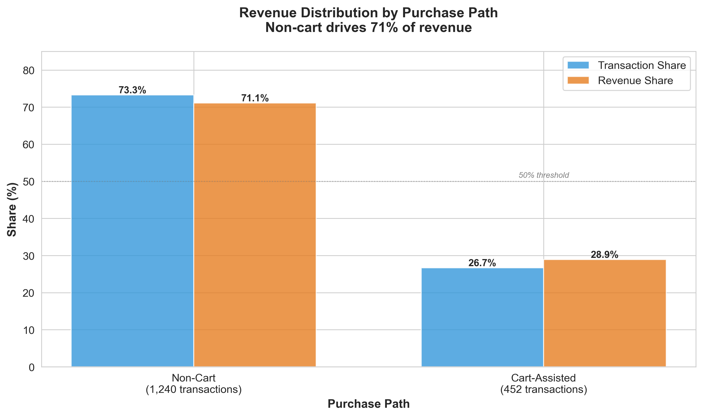
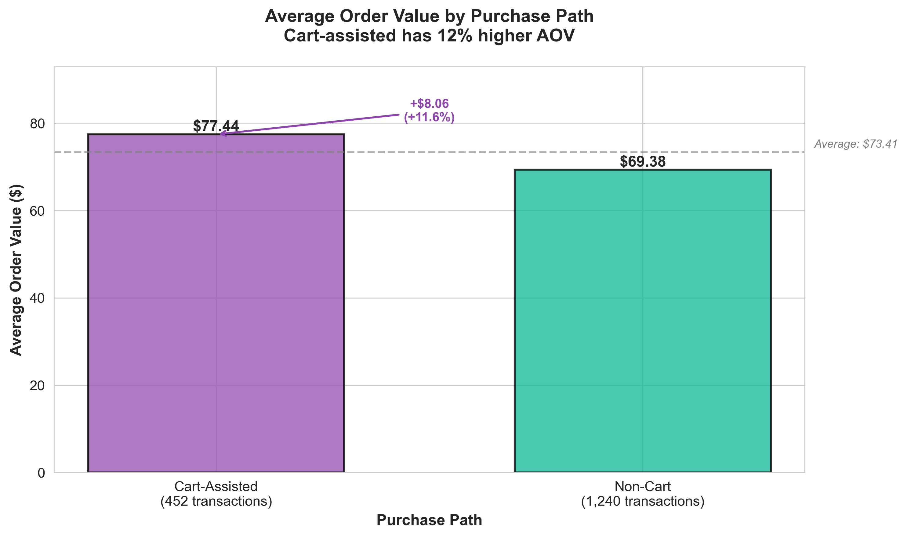
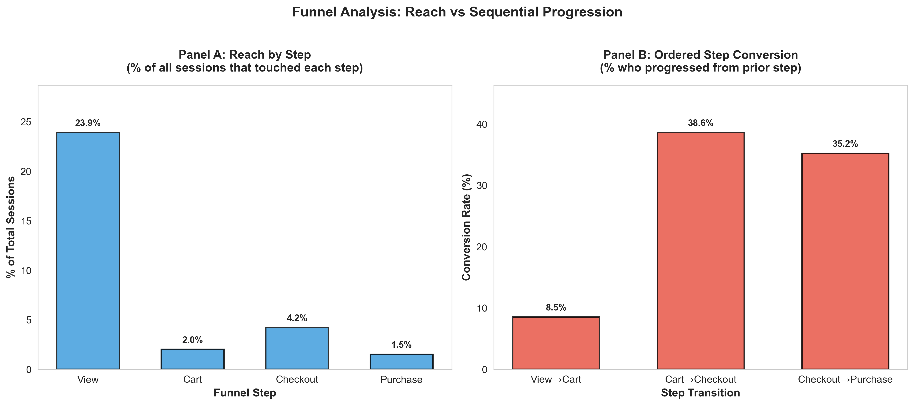
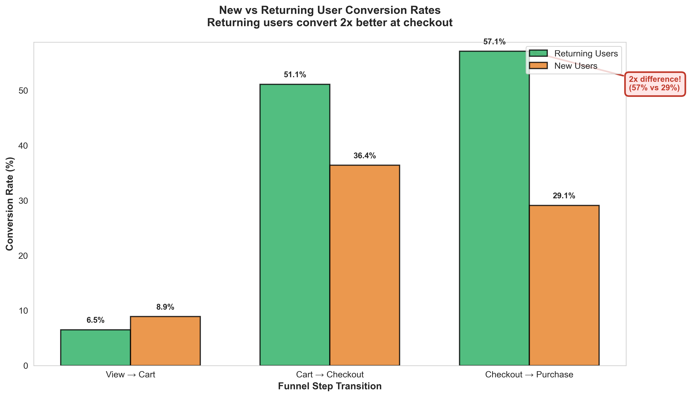

## Executive Summary

This analysis uses **SQL in BigQuery** on the GA4 public ecommerce sample (Google Merchandise Store) for **Nov 1–30, 2020**. We rebuilt sessions from event-level rows, then analyzed:

1. where conversion leakage happens (in-order, session-level funnel)
2. how leakage looks across key segments (device, country, user type, first-touch source buckets)
3. which journey path actually drives transactions + revenue (cart-assisted vs non-cart)

**Main result:** the most actionable gap is **non-cart checkout abandonment**. A large share of sessions reach checkout without a cart, and that path both (a) leaks hard and (b) carries most of the revenue volume.

## About the Data

**Source website:** Google Merchandise Store (Google-branded products ecommerce)  
**Site:** [https://www.googlemerchandisestore.com/](https://www.googlemerchandisestore.com/)  
**BigQuery dataset:** `bigquery-public-data.ga4_obfuscated_sample_ecommerce`  
**Window analyzed:** 2020-11-01 to 2020-11-30  
**Schema type:** GA4 event export (each row = one event)  

### Data at a glance

| Metric                      |     Value |
| --------------------------- | --------: |
| Events (rows)               | 1,472,712 |
| Users (`user_pseudo_id`)    |    79,421 |
| Reconstructed sessions      |   108,401 |
| Event types observed        |        17 |
| Purchase sessions           |     1,617 |
| Transactions (distinct IDs) |     1,259 |
| Revenue                     |   144,260 |

### Core fields used in this analysis

* **Sessionization:** `user_pseudo_id`, `event_params.ga_session_id`
* **Sequence logic:** `event_name`, `event_timestamp`
* **Commerce:** `ecommerce.transaction_id`, `ecommerce.purchase_revenue`, `ecommerce.purchase_revenue_in_usd`
* **Segments:** `device.category`, `geo.country`, `traffic_source.source/medium`, `user_first_touch_timestamp`

For full schema/profile details, see **Data Introduction.md**.

## Simplified Important Info

### 1) Key finding: non-cart checkout is where the money leaks
Non-cart checkout is defined as sessions that hit **begin_checkout** without a valid prior **add_to_cart** in the same session.

Here’s the punchline:

* **3,736** sessions reached **non-cart checkout traffic**
* only **1,198** of those ended in purchase
* that’s **32.1% conversion** and **67.9% abandonment**
* the abandoned volume is **2,538 sessions** (this is the single biggest “fixable” pool closest to purchase)

Why this matters: non-cart checkout is also the dominant purchase path economically (see next finding). So improving it moves revenue, not just vanity funnel metrics.

**Quick opportunity sizing**

* Non-cart checkout sessions: **3,736**
* Current conversion: **32.1%**
* If we lift non-cart checkout conversion to **40%** (still below cart-assisted quality), that’s +**~8pp**

  * incremental purchases ≈ 3,736 × 8% ≈ **299**
  * at non-cart AOV ≈ **$69** → **~$20K incremental monthly revenue**

Working hypothesis to validate next: friction in the fast path (auth/sign-in prompts, form length, payment step issues, shipping/tax surprise, error handling).

### 2) Revenue volume comes mostly from non-cart purchases

Path economics shows two purchase families:

* **purchase_non_cart**

  * **73.2%** of transactions
  * **71.1%** of deduped revenue
* **purchase_cart_assisted**

  * **26.7%** of transactions
  * **28.9%** of deduped revenue

Interpretation: most monetization is happening through sessions that do **checkout → purchase** without a cart step. That’s why non-cart checkout abandonment is the top priority.

### 3) Cart-assisted buyers are fewer, but each order is larger

This is the volume vs value split:

* **AOV (average order value)** = revenue per transaction
* Cart-assisted AOV ≈ **$77.44**
* Non-cart AOV ≈ **$69.38**

Interpretation: cart-assisted journeys tend to produce bigger baskets, even though they’re fewer. So cart isn’t “useless” — it’s just not the main volume driver in this dataset.

### 4) Early-stage leakage is huge, but it’s not the headline

Ordered **view → cart** conversion is **8.45%** (91.55% leak after view). That’s expected in ecommerce: lots of browsing, few purchases.

It’s still useful as context because it tells us: there’s a massive pool of “browsers” — but the *more actionable* work (near-term revenue impact) sits closer to payment, especially in non-cart checkout.

### 5) Practical reporting model going forward

A single cart-first funnel is misleading here. Reporting should always split paths:

1. **Cart-assisted path KPIs** (view → cart → checkout → purchase)
2. **Non-cart path KPIs** (entry/view → checkout → purchase)

This keeps the story aligned with observed behavior and avoids hiding the dominant purchase flow.

## More Detailed Analysis

### A) Event-level structure snapshot and why session rebuild is required

GA4 export is event-level: one row = one event. A single session shows up across many rows, so session-level funnel logic requires sessionization.

Example structure (illustrative)

| event_date |  event_timestamp | user_pseudo_id | ga_session_id | event_name     | transaction_id | purchase_revenue | device  | country       |
| ---------- | ---------------: | -------------- | ------------: | -------------- | -------------- | ---------------: | ------- | ------------- |
| 20201112   | 1605172200123456 | U_001          |    1605172200 | session_start  | null           |             null | desktop | United States |
| 20201112   | 1605172210456789 | U_001          |    1605172200 | view_item      | null           |             null | desktop | United States |
| 20201112   | 1605172240123456 | U_001          |    1605172200 | begin_checkout | null           |             null | desktop | United States |
| 20201112   | 1605172260789012 | U_001          |    1605172200 | purchase       | T_98765        |            85.00 | desktop | United States |

Session key used everywhere in this work:

* `ga_session_id` is extracted from `event_params`
* `ga_session_id` alone is not globally unique
* session key = `CONCAT(user_pseudo_id, '-', ga_session_id)`

### B) How ordered funnel progression was measured

For each session we compute the **first timestamp** of each step:

* `ts_view` = first `view_item`
* `ts_cart` = first `add_to_cart`
* `ts_checkout` = first `begin_checkout`
* `ts_purchase` = first `purchase`

Then we only count a transition if the order is correct:

* view → cart if `ts_cart >= ts_view`
* cart → checkout if `ts_checkout >= ts_cart`
* checkout → purchase if `ts_purchase >= ts_checkout`

This prevents “I saw both events somewhere in the session” from being treated like a real progression.

### C) Path-family framework used for economics

Sessions are assigned to a mutually exclusive family so we can attach transactions + revenue cleanly:

| Path family                          | Definition                                                   |
| ------------------------------------ | ------------------------------------------------------------ |
| `purchase_cart_assisted`             | checkout + purchase exist, and cart happened before checkout |
| `purchase_non_cart`                  | checkout + purchase exist, but no valid cart before checkout |
| `checkout_no_purchase_cart_assisted` | checkout reached via cart, no purchase                       |
| `checkout_no_purchase_non_cart`      | checkout reached without valid cart, no purchase             |
| `cart_no_checkout`                   | cart happened, no checkout/purchase                          |
| `view_only`                          | view happened, no checkout/purchase                          |
| `other_or_no_funnel`                 | everything else outside these funnel events                  |

This is what makes it possible to say “non-cart is most of revenue” without mixing incompatible journeys.

### D) Revenue handling choice

Two revenue views exist:

1. **Event-level revenue**: sum of `purchase` event revenue
2. **Transaction-deduped revenue**: dedupe by `(session_key, transaction_id)` then sum

We use **deduped** as the primary economics view because purchase events can duplicate, and transaction-level is the safer base for AOV and revenue share comparisons.

### E) Interpretation guardrails

* Reach vs ordered progression answer different questions; both are needed.
* Source/medium is first-touch and partially obfuscated, so segment cuts by source should stay coarse.
* Path-family “purchase rate = 100%” is just the labeling definition (purchase families are defined by having purchase).

## Final takeaway

* The broad funnel drop from browsing is normal.
* The *actionable* story is closer to purchase: **non-cart checkout is the dominant revenue path and the largest abandonment pool**.
* Fixing non-cart checkout completion is the clearest near-term lever, while cart-assisted remains a smaller but higher-value track.
* Reporting should be dual-path by default so we don’t force everything into a cart-first narrative.
